#  Tizeno

Tizeno is a beautiful open-source notes app for Android. It is built with Dart on top of Google's Flutter Framework.


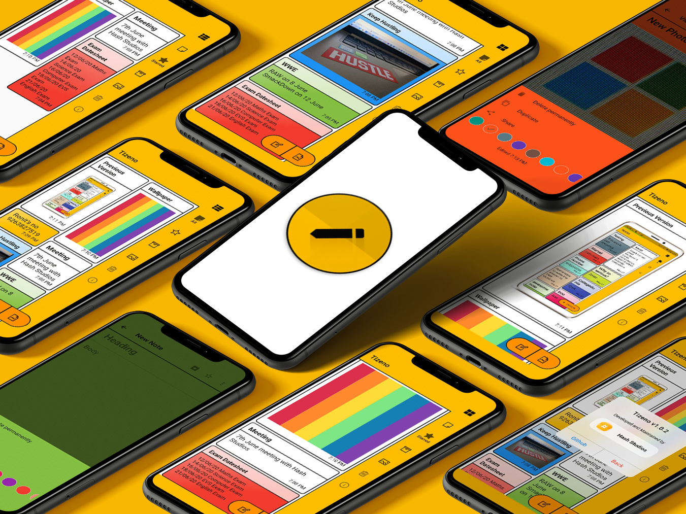

Tizeno helps one create quick notes, photo notes and more. One can change the color of the notes, mark them as starred or archived, create photo notes and save them locally, storing everything on a SQLite database.

## List of Contents

1. [Features](#features)
2. [Demo](#demo)
3. [Dependencies](#dependencies)
4. [Usage](#usage)
5. [Development](#development)
6. [License](#license)
7. [Contributors](#contributors)
8. [To-Do](#to-do)

## Features

- Create long text notes
- Secure data storage on SQLite
- View notes as Staggered Tiles or List Tiles
- Create photo notes
- Mark notes as important/star
- Archive older notes
- Delete individual notes or all notes
- Robust data storing, works even if you delete photos
- Toast/Snackbar supported buttons
- Supports Google Fonts universally
- Minimal design with smooth transitions
- Undo to previous saved iteration
- Duplicate notes with one-tap
- View last edited time/date
- Optimised storage using minimal packages
- Application size under 10 MB
- Beautiful Amber color UI

## Demo

**Screens**

| 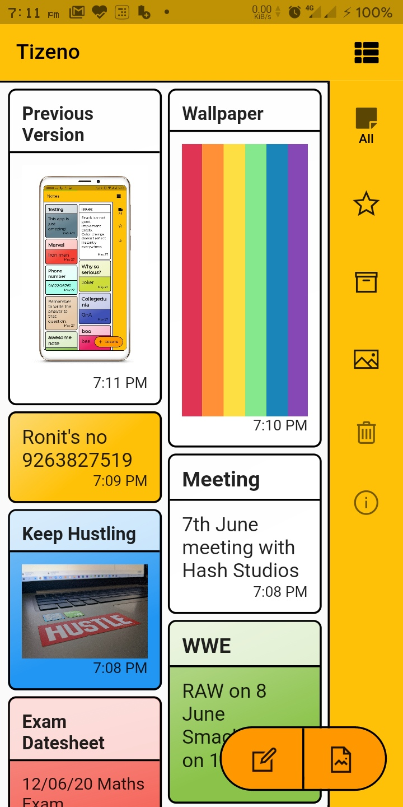 | 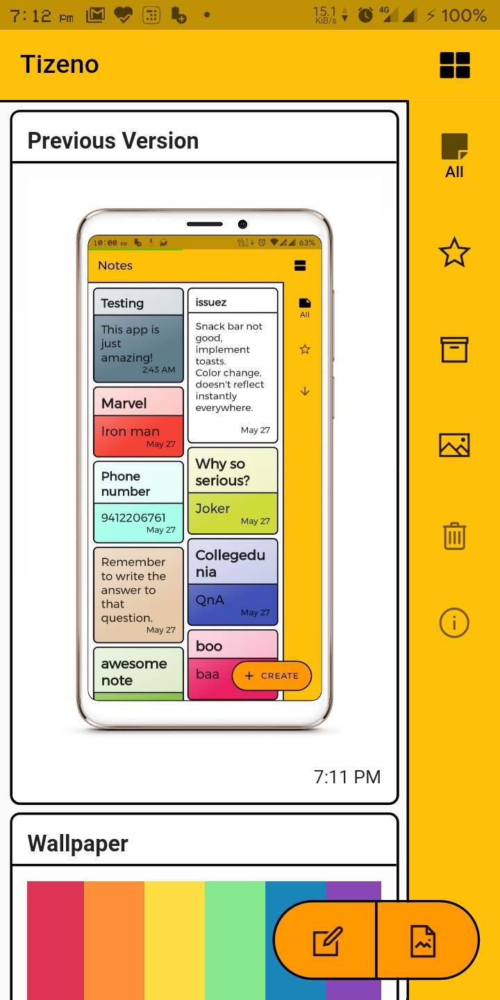 | 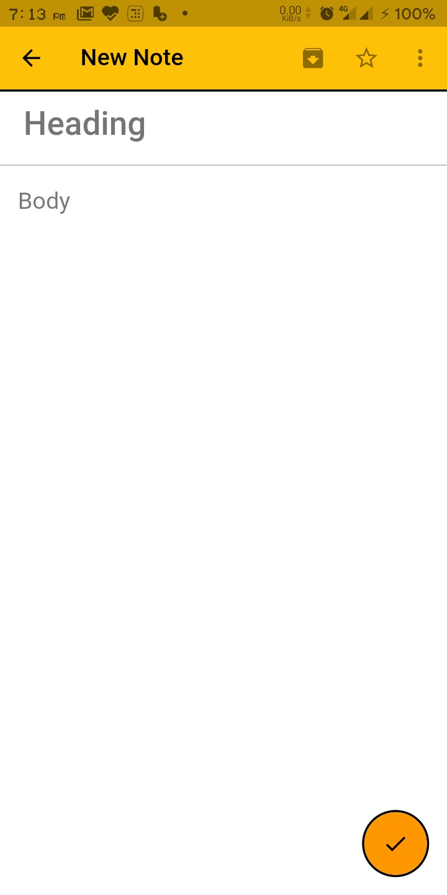 | 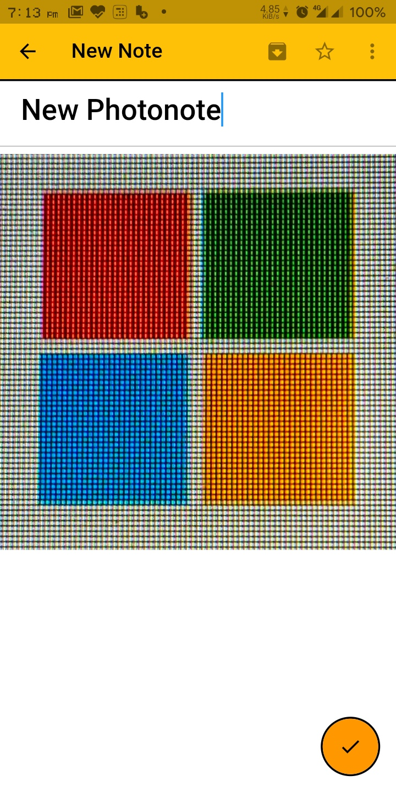 | 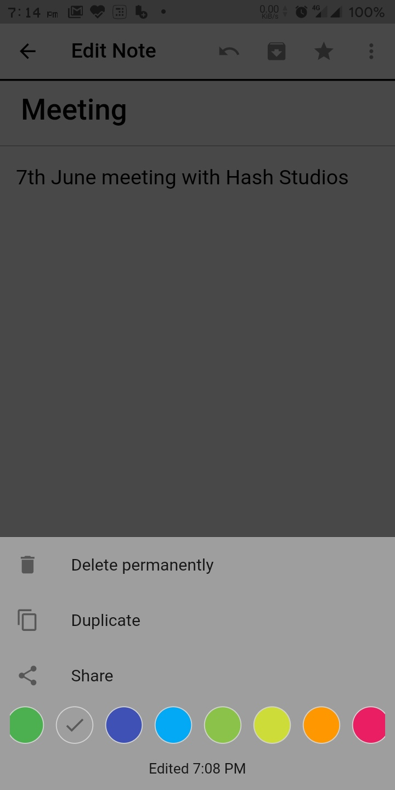 |
| :-------------: | :-------------:  | :-------------:  | :-------------:  | :-------------:  |
|     Main Screen     |    Main List Screen    |    New Note    |     New Photo Note       |     Edit note     |


| 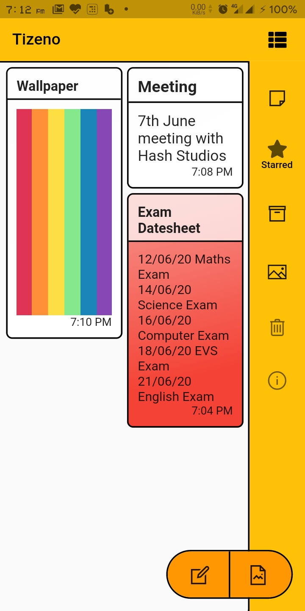 | 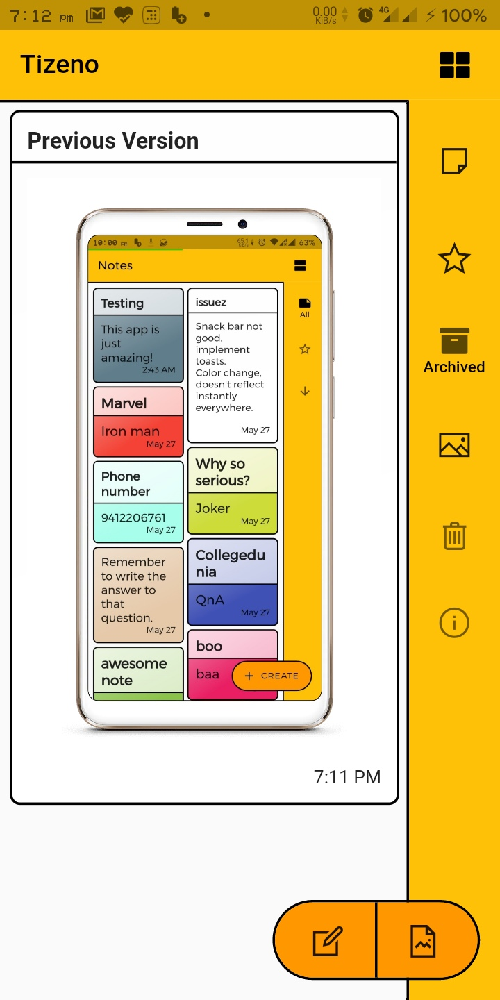| 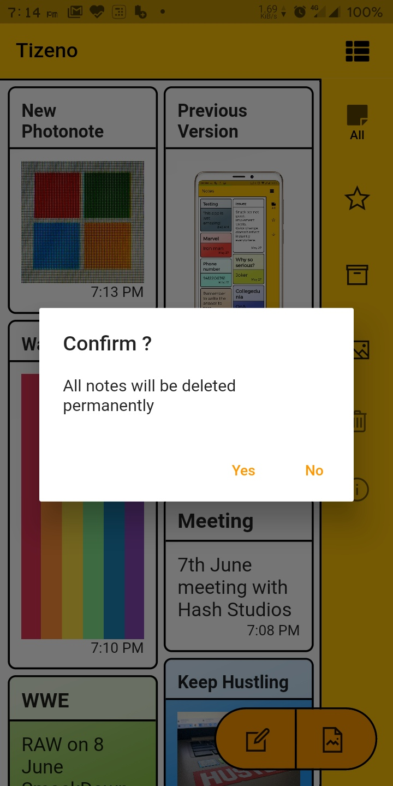| 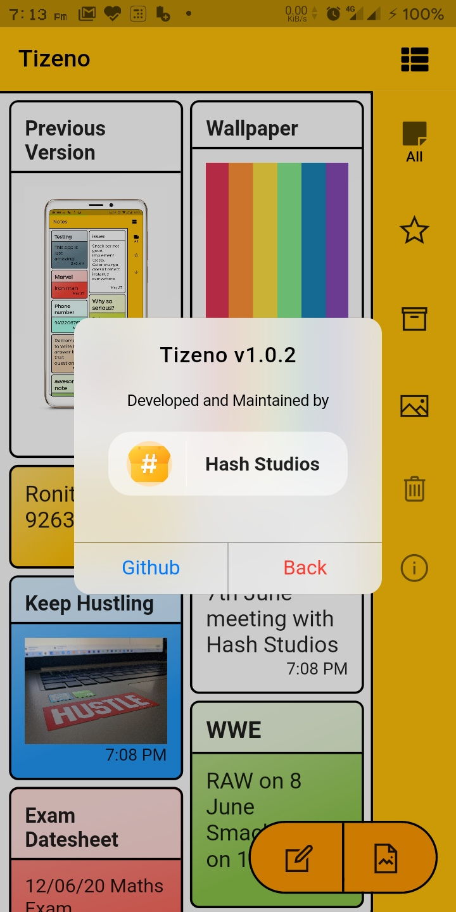 | 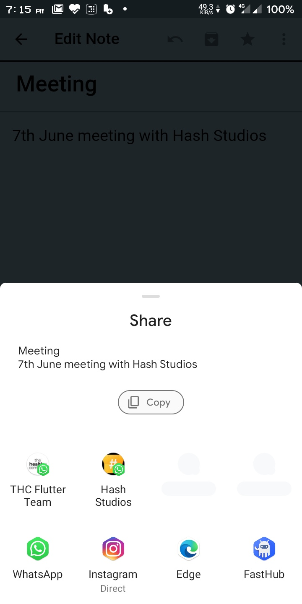|
| :-------------:  | :-------------: | :-------------: | :-------------:  | :-------------: |
|  Starred Notes  |Archived Notes|  Delete All    |      About   |      Share  |

## Dependencies

The following packages are needed for the development of this application.

- `flutter_staggered_grid_view: ^0.3.0`
- `sqflite: ^1.3.0+1`
- `auto_size_text: ^2.1.0`
- `intl: ^0.16.1`
- `google_fonts: ^1.1.0`
- `flutter_screenutil: ^1.1.0`
- `image_picker: ^0.6.7`
- `font_awesome_flutter: ^8.8.1`
- `line_awesome_icons: ^1.0.4+2`
- `gallery_saver: ^2.0.1`
- `url_launcher: ^5.4.10`
- `photo_view: ^0.9.2`
- `flutter_share_content: ^0.2.1+1`
- `cupertino_icons: ^0.1.2`
- `provider: ^3.1.0`
- `share: ^0.6.4+3`

More details about these can be found in the [`pubspec.yaml`](https://github.com/Hash-Studios/flutter-notes-app/tree/master/pubspec.yaml) file.

## Usage

The application files for Android devices can be found under the [`release`](https://github.com/Hash-Studios/flutter-notes-app/releases) section.
- [`app-arm64-v8a-release`](https://github.com/Hash-Studios/flutter-notes-app/releases/download/latest/app-arm64-v8a-release.apk) For most users, this will work. It is for ARM x64 based devices.
- [`app-armeabi-v7a-release`](https://github.com/Hash-Studios/flutter-notes-app/releases/download/latest/app-armeabi-v7a-release.apk) It is for ARM-based devices.
- [`app-x86_64-release`](https://github.com/Hash-Studios/flutter-notes-app/releases/download/latest/app-x86_64-release.apk) It is for x86 based devices.
<!-- 
More information about the releases can be found in the [Release](https://github.com/Hash-Studios/flutter-notes-app/releases) tab. -->

## Development

Start by forking the repository, and then run `flutter pub get` in the local repository. You are now ready to modify, fix, update, or remove any feature in the app. If you want, you can create pull requests, we will be happy to welcome them.
>Note: This project requires Flutter Framework to be installed on your machine.

## License

This app is licensed under the [`BSD 3-Clause License`](https://github.com/Hash-Studios/flutter-notes-app/tree/master/LICENSE.txt).
Any Usage of the source code must follow the below license.

```
BSD 3-Clause License

Copyright (c) 2020 Hash Studios
All rights reserved.

Redistribution and use in source and binary forms, with or without
modification, are permitted provided that the following conditions are met:

1. Redistributions of source code must retain the above copyright notice, this
   list of conditions and the following disclaimer.

2. Redistributions in binary form must reproduce the above copyright notice,
   this list of conditions and the following disclaimer in the documentation
   and/or other materials provided with the distribution.

3. Neither the name of the copyright holder nor the names of its
   contributors may be used to endorse or promote products derived from
   this software without specific prior written permission.

THIS SOFTWARE IS PROVIDED BY THE COPYRIGHT HOLDERS AND CONTRIBUTORS "AS IS"
AND ANY EXPRESS OR IMPLIED WARRANTIES, INCLUDING, BUT NOT LIMITED TO, THE
IMPLIED WARRANTIES OF MERCHANTABILITY AND FITNESS FOR A PARTICULAR PURPOSE ARE
DISCLAIMED. IN NO EVENT SHALL THE COPYRIGHT HOLDER OR CONTRIBUTORS BE LIABLE
FOR ANY DIRECT, INDIRECT, INCIDENTAL, SPECIAL, EXEMPLARY, OR CONSEQUENTIAL
DAMAGES (INCLUDING, BUT NOT LIMITED TO, PROCUREMENT OF SUBSTITUTE GOODS OR
SERVICES; LOSS OF USE, DATA, OR PROFITS; OR BUSINESS INTERRUPTION) HOWEVER
CAUSED AND ON ANY THEORY OF LIABILITY, WHETHER IN CONTRACT, STRICT LIABILITY,
OR TORT (INCLUDING NEGLIGENCE OR OTHERWISE) ARISING IN ANY WAY OUT OF THE USE
OF THIS SOFTWARE, EVEN IF ADVISED OF THE POSSIBILITY OF SUCH DAMAGE.
```

## Contributors

<a href="https://github.com/Hash-Studios/flutter-notes-app/graphs/contributors">
  
</a>

